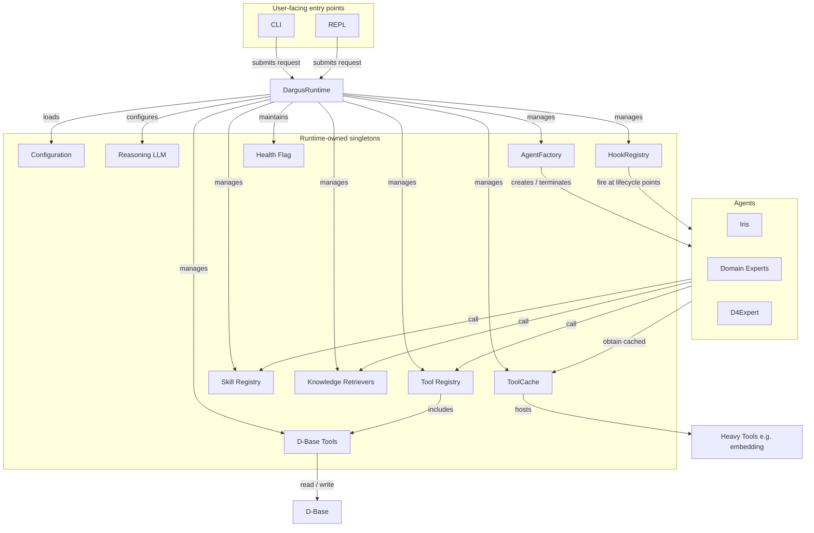

# Runtime Design

> Dargus v1.0.0 runs inside a single **DargusRuntime**. The runtime is the program container registered with the OS task manager; it owns configuration, the hook registry, the dependency graph, and D-Base access through tools. Agents receive their dependencies from the runtime.

## DargusRuntime

`DargusRuntime` is created at process startup and lives for the lifetime of the program. It is the single owner of every runtime singleton and the lifecycle boundary for a Dargus session. All Agents receive their dependencies from the runtime, either directly or through the `AgentFactory`. The factory creates and terminates every Agent, including Iris, Domain Experts, and D4Expert. This makes the system testable: any dependency can be replaced with a fake or stub without changing Agent code.

### Components

The runtime controls the following components:

| Component | What the runtime does with it |
|---|---|
| **Configuration** | Loads `dargus_config.yaml` and exposes resolved settings to every other component. |
| **Reasoning LLM** | Holds the single v1.0.0 model used by all Agents. |
| **Tool Registry** | Registers and resolves every Tool, including D-Base tools and heavy cached tools. |
| **Skill Registry** | Registers and resolves Skills that orchestrate workflows. |
| **Knowledge Retrievers** | Provides lookup interfaces for project-level knowledge (vocabularies, endpoint mappings, model metadata). |
| **D-Base Tools** | Mediates all reads and writes to the cumulative evidence store. |
| **HookRegistry** | Stores hook registrations and executes them at the named lifecycle points. |
| **AgentFactory** | Creates and terminates every Agent, injecting runtime-provided dependencies. |
| **ToolCache** | Keeps session-resident heavy tools (e.g. the embedding model) in memory across PRA cycles. |
| **Entry points** | Packages CLI and REPL interfaces that submit work to the runtime. |
| **Health Flag** | Tracks whether the runtime is healthy enough to accept new sessions. |

#### Component relations

### Reasoning model

For v1.0.0 every Agent uses one fixed reasoning model configured in `dargus_config.yaml`; the runtime therefore does not contain a model router.

### ToolCache

Heavy tools that keep local models or other expensive resources in memory declare themselves session-resident. The runtime creates a `ToolCache` when a session starts and closes it at `SESSION_END`. Stateless tools are still instantiated on demand. This avoids reloading, for example, the embedding model on every PRA cycle during a long ingest task while keeping memory usage predictable.

### Health flag

The runtime starts healthy. It becomes unhealthy if an unrecoverable dependency fails (e.g., D-Base inaccessible, model unavailable). CLI/REPL entry points check the flag and refuse to start new sessions while unhealthy; recovery requires a runtime restart.

## Hooks

Hooks are observer/callback functions registered at named points in the agent lifecycle. They are owned and executed by the runtime, but their design and semantics are documented separately in `5_hooks.md`.

## v1.0.0 scope

- `DargusRuntime` with DI wiring, `AgentFactory`, entry-point packaging, health flag, and session-scoped `ToolCache`.
- Single fixed reasoning model for all Agents.
- Workflows delegate to hook-aware functions rather than embedding policy directly in Agents.
